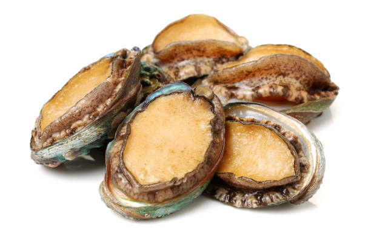
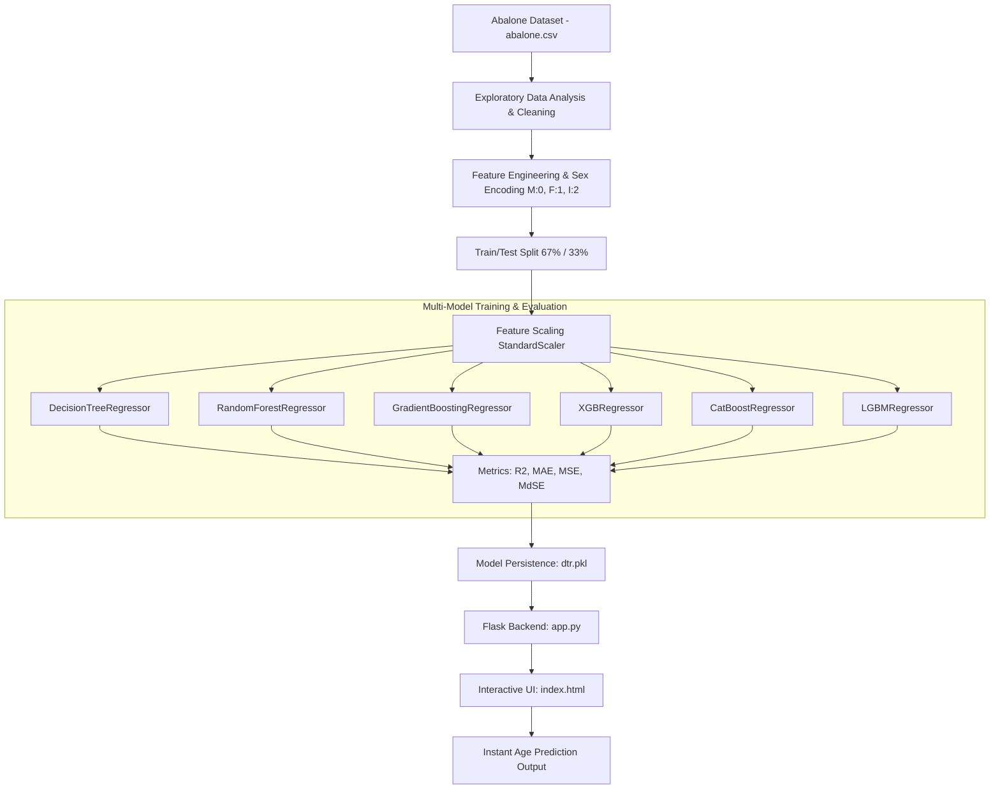

# 🐚 Abalone Age Prediction using Machine Learning
### An End-to-End Machine Learning Pipeline & Interactive Flask Web Application for Non-Destructive Abalone Age Estimation

[](https://www.python.org/)
[](https://flask.palletsprojects.com/)
[](https://scikit-learn.org/)
[](https://xgboost.readthedocs.io/)
[](https://lightgbm.readthedocs.io/)
[](https://catboost.ai/)
[](LICENSE)

---

<p align="center">
  
</p>

---

## 📌 Project Overview

**Abalone** is a marine gastropod mollusk with significant economic and culinary value worldwide. Determining the age of an abalone is crucial for harvesting regulation, marine biology research, and aquaculture resource management.

Traditionally, determining an abalone's age requires a tedious, destructive, and labor-intensive laboratory process:
1. The shell must be carefully cut through the cone.
2. The section is stained and polished.
3. The growth rings (*rings*) are manually counted under a microscope (each ring represents roughly one year of growth, with the actual age calculated as `Age = Rings + 1.5`).

> **Project Mission:**
> Build an automated, non-destructive **Machine Learning** regression system capable of accurately predicting an abalone's age from easily measurable physical and morphological characteristics (such as dimensions and weights), integrated into an interactive **Flask Web Application** for instant real-time predictions.

---

## ✨ Key Features

- 📊 **Exploratory Data Analysis (EDA):** In-depth distribution analysis, correlation matrix heatmaps, duplicate checks, and feature relationships.
- 🔄 **Feature Engineering & Preprocessing:**
  - Categorical encoding for the `Sex` attribute (`M: 0`, `F: 1`, `I: 2`).
  - Feature scaling analysis using `StandardScaler`.
  - Balanced 67% / 33% Train-Test split.
- 🚀 **Multi-Model Benchmarking:** Comparison of state-of-the-art regression algorithms:
  - **Decision Tree Regressor (DTR)** (Exported production model)
  - **Random Forest Regressor**
  - **Gradient Boosting Regressor**
  - **XGBoost Regressor**
  - **CatBoost Regressor**
  - **LightGBM Regressor**
- 📏 **Comprehensive Evaluation Metrics:**
  - $R^2$ Score (Coefficient of Determination)
  - MAE (Mean Absolute Error)
  - MSE (Mean Squared Error)
  - MdSE (Median Absolute Error)
- 🌐 **Interactive Flask Web Application:**
  - Responsive, clean user interface with input validation.
  - Real-time model inference and immediate age display.

---

## 🏗️ Workflow Architecture



---

## 📋 Dataset Description

The dataset comprises **4,177** instances with **8 continuous/nominal features** and **1 integer target variable**:

| Feature Name | Description | Unit | Data Type |
| :--- | :--- | :--- | :--- |
| **Sex** | Gender of the abalone (`M = 0`, `F = 1`, `I = 2` for Infant) | Category | Nominal |
| **Length** | Longest shell measurement | mm | Continuous |
| **Diameter** | Measurement perpendicular to length | mm | Continuous |
| **Height** | Shell height with meat inside | mm | Continuous |
| **Whole weight** | Total weight of the whole abalone | Grams | Continuous |
| **Shucked weight** | Weight of meat only | Grams | Continuous |
| **Viscera weight** | Gut weight (after bleeding) | Grams | Continuous |
| **Shell weight** | Weight of the dry shell | Grams | Continuous |
| **Rings (Target)** | Count of shell rings (`Actual Age = Rings + 1.5`) | Count | Integer |

---

## 🧪 Model Comparison & Evaluation

Six leading regression algorithms were evaluated to capture both linear and non-linear patterns in morphological growth:

| Model | Algorithm Family | Key Advantage |
| :--- | :--- | :--- |
| **CatBoost Regressor** | Symmetric Tree Gradient Boosting | Robust against overfitting with categorical resilience |
| **XGBoost Regressor** | Regularized Gradient Boosting | High computational efficiency and regression accuracy |
| **LightGBM Regressor** | Leaf-wise Gradient Boosting | Ultra-fast execution and scalability |
| **Random Forest Regressor** | Ensemble Bagging | Strong generalization variance reduction |
| **Gradient Boosting Regressor** | Sequential Gradient Boosting | Continuous residual minimization |
| **Decision Tree Regressor** | Tree-based Partitioning | Fast, interpretable, lightweight deployment (`dtr.pkl`) |

---

## 📁 Project Structure

```plaintext
├── Abalone_Age_Prediction_Machine_Learning.ipynb   # Complete Jupyter Notebook (EDA & Modeling)
├── abalone.csv                                     # Clean dataset with 4,177 records
├── app.py                                          # Flask web server backend
├── index.html                                      # Frontend user interface
├── dtr.pkl                                         # Serialized pre-trained ML model
├── img.jpg                                         # Visual asset representing Abalone
├── requirements.txt                                # Python package dependencies
├── .gitignore                                      # Ignored build, cache, and env files
├── LICENSE                                         # MIT Open Source License
└── README.md                                       # Comprehensive project documentation
```

---

## ⚙️ Installation & Getting Started

### 1. Clone the Repository
```bash
git clone https://github.com/M0saeed/Abalone-Age-Prediction-Machine-Learning.git
cd Abalone-Age-Prediction-Machine-Learning
```

### 2. Create and Activate a Virtual Environment
```bash
# On Windows
python -m venv venv
venv\Scripts\activate

# On macOS / Linux
python3 -m venv venv
source venv/bin/activate
```

### 3. Install Dependencies
```bash
pip install -r requirements.txt
```

### 4. Run the Web Application
```bash
python app.py
```
Open your browser and navigate to:
```
http://127.0.0.1:5000/
```

### 5. Explore the Jupyter Notebook
To view the data exploration, correlation matrices, and model benchmarks:
```bash
jupyter notebook Abalone_Age_Prediction_Machine_Learning.ipynb
```

---

## 💻 Programmatic Usage (Python API)

You can easily integrate and run inference with the saved model in any Python environment:

```python
import pickle
import numpy as np

# 1. Load the trained Decision Tree model
with open('dtr.pkl', 'rb') as f:
    model = pickle.load(f)

# 2. Input features format:
# [Sex (0=M, 1=F, 2=I), Length, Diameter, Height, Whole_weight, Shucked_weight, Viscera_weight, Shell_weight]
sample_input = np.array([[2, 0.33, 0.255, 0.08, 0.205, 0.0895, 0.0395, 0.055]])

# 3. Predict number of rings
predicted_rings = model.predict(sample_input)[0]
estimated_age = predicted_rings + 1.5

print(f"Predicted Rings : {predicted_rings:.2f}")
print(f"Estimated Age   : {estimated_age:.2f} years")
```

---

## 👨‍💻 Author

- **Mohamed Saeed**
- **GitHub:** [@M0saeed](https://github.com/M0saeed)
- **Email:** [m75hamedsaeed@gmail.com](mailto:m75hamedsaeed@gmail.com)

---

## 📄 License

This project is open-source and licensed under the [MIT License](LICENSE).
