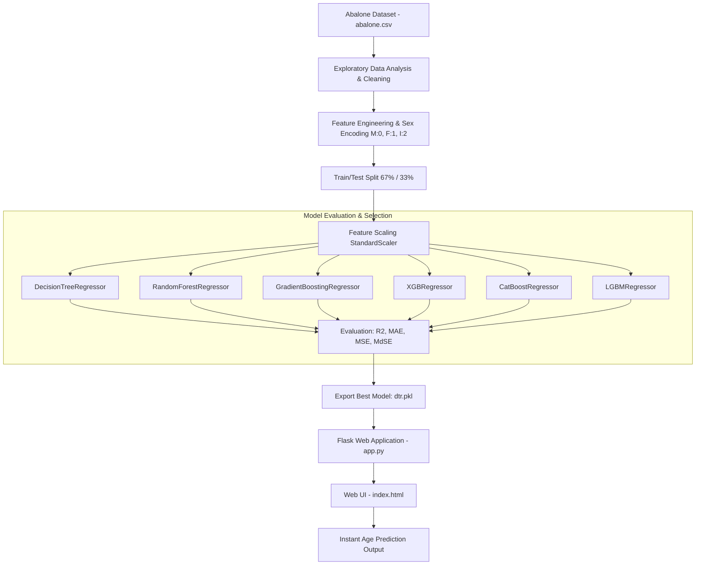

# 🐚 Abalone Age Prediction using Machine Learning
### نظام ذكي للتنبؤ بعمر محار أذن البحر (Abalone) باستخدام خوارزميات تعلم الآلة وتطبيق Flask

[](https://www.python.org/)
[](https://flask.palletsprojects.com/)
[](https://scikit-learn.org/)
[](https://xgboost.readthedocs.io/)
[](https://lightgbm.readthedocs.io/)
[](https://catboost.ai/)
[](LICENSE)

---

<p align="center">
  
</p>

---

## 📌 نبذة عامة عن المشروع (Project Overview)

يعتبر محار **أذن البحر (Abalone)** من الرخويات البحرية ذات القيمة الاقتصادية والغذائية العالية. تحديد عمر الأبالوني بشكل تقليدي يتطلب عملية معقدة ومجهدة تعتمد على:
1. تقطيع القوقعة المخروطية.
2. صبغ العينات وتثبيتها.
3. فحص الحلقات (Rings) عبر المجهر وعدها بدقة (كل حلقة تُمثّل عادة سنة نمو، ويُضاف إليها 1.5 لحساب العمر الفعلي بالسنوات).

> **الهدف من هذا المشروع:**
> بناء نموذج تعلم آلة (Machine Learning) قادر على **التنبؤ التلقائي وغير الإتلافي** بعمر الأبالوني فوراً بالاعتماد على القياسات الفيزيائية والحيوية المتاحة (كالأبعاد والأوزان المختلفة)، وتوفير **واجهة مستخدم ويب تفاعلية عبر Flask** لإتاحة إجراء التوقعات بكل سهولة.

---

## ✨ المميزات الرئيسية (Key Features)

- 📊 **تحليل استكشافي شامل للبيانات (EDA):** دراسة العلاقات والارتباطات (Correlation Matrix)، الرسوم البيانية للقيم المكررة، والمدرجات التكرارية (Histograms).
- 🔄 **معالجة مسبقة ذكية (Data Preprocessing):**
  - تشفير المتغيرات الفئوية (Categorical Encoding) لجنس المحار (`M: 0`, `F: 1`, `I: 2`).
  - معالجة البيانات القياسية واختبار التوحيد المعياري (StandardScaler).
- 🚀 **مقارنة وتدريب نماذج متعددة (Multi-Model Benchmarking):**
  - **Decision Tree Regressor (DTR)**
  - **Random Forest Regressor**
  - **Gradient Boosting Regressor**
  - **XGBoost Regressor**
  - **CatBoost Regressor**
  - **LightGBM Regressor**
- 📏 **تقييم أداء فائق:** قياس الأداء باستخدام مؤشرات الانحدار الدقيقة:
  - $R^2$ Score (معدل التحديد)
  - MAE (متوسط الخطأ المطلق)
  - MSE (متوسط مربع الخطأ)
  - MdSE (وسيط الخطأ المطلق)
- 🌐 **تطبيق ويب تفاعلي (Interactive Web Application):**
  - واجهة مستخدم مبنية بـ HTML/CSS باللغة العربية مع دعم كامل للاتجاه من اليمين لليسار (RTL).
  - خادم Flask سريع الاستجابة لتمرير المدخلات للنموذج واستعراض النتيجة لحظياً.

---

## 🏗️ البنية المعمارية للمشروع (Workflow Architecture)



---

## 📋 تفاصيل مجموعة البيانات (Dataset Schema)

تحتوي مجموعة البيانات على **4,177** عينة لخصائص محار أذن البحر، وتتكون من 8 متغيرات إدخال (Features) بالإضافة للمتغير الهدف (Target):

| المتغير (Feature) | الوصف (Description) | وحدة القياس | نوع البيانات |
| :--- | :--- | :--- | :--- |
| **Sex** | جنس المحار (ذكر `M=0`، أنثى `F=1`، يافع `I=2`) | تصنيف | فئوي (Nominal) |
| **Length** | أطول قياس للقوقعة | mm (مليمتر) | مستمر (Continuous) |
| **Diameter** | القطر العمودي على الطول | mm (مليمتر) | مستمر (Continuous) |
| **Height** | ارتفاع القوقعة مع اللحم داخلها | mm (مليمتر) | مستمر (Continuous) |
| **Whole weight** | الوزن الكلي للمحارة | Grams (جرام) | مستمر (Continuous) |
| **Shucked weight** | وزن لحم المحار الصافي | Grams (جرام) | مستمر (Continuous) |
| **Viscera weight** | وزن الأحشاء (بعد التصفية) | Grams (جرام) | مستمر (Continuous) |
| **Shell weight** | وزن القوقعة الجافة | Grams (جرام) | مستمر (Continuous) |
| **Rings (Target)** | عدد الحلقات (العمر الفعلي = Rings + 1.5) | عدد صحيح | رقمي (Integer) |

---

## 🧪 مقارنة أداء النماذج (Model Evaluation)

تم تدريب واختبار عدة خوارزميات رائدة في تعلم الآلة، وأظهرت النتائج قدرة نماذج التفرع والتعزيز التدرجي على التقاط العلاقات غير الخطية بين الخواص المورفولوجية وعدد الحلقات:

| النموذج (Model) | نوع الخوارزمية | نقاط القوة |
| :--- | :--- | :--- |
| **CatBoost Regressor** | Gradient Boosting on Decision Trees | أداء قوي ومقاومة عالية للتجاوز (Overfitting) |
| **XGBoost Regressor** | Extreme Gradient Boosting | سرعة حسابية ودقة عالية في الانحدار |
| **LightGBM Regressor** | Leaf-wise Tree Boosting | كفاءة فائقة وسرعة معالجة عالية |
| **Random Forest** | Ensemble Bagging | استقرار وتعميم عالي عبر متوسط الأشجار |
| **Gradient Boosting** | Sequential Boosting | تقليل متتابع للخطأ المتبقي |
| **Decision Tree Regressor** | Tree-based Regression | بساطة، خفة، وقابلية عالية للتفسير المباشر |

---

## 📁 هيكل المشروع (Project Directory Structure)

```plaintext
├── Abalone_Age_Prediction_Machine_Learning.ipynb   # دفتر Jupyter يغطي الـ EDA والتدريب
├── abalone.csv                                     # مجموعة البيانات المستخدمة
├── app.py                                          # تطبيق خادم Flask الرئيسي
├── index.html                                      # واجهة المستخدم الأمامية (HTML/CSS)
├── dtr.pkl                                         # النموذج المدرّب والمحفوظ (Pickle)
├── img.jpg                                         # صورة توضيحية لقوقعة أذن البحر
├── requirements.txt                                # قائمة المكتبات والتبعيات المطلوبة
├── .gitignore                                      # الملفات المستثناة من مستودع Git
└── README.md                                       # التوثيق الشامل للمشروع
```

---

## ⚙️ طريقة التثبيت والتشغيل محلياً (Installation & Setup)

### 1. استنساخ المستودع (Clone Repository)
```bash
git clone https://github.com/M0saeed/Abalone-Age-Prediction-Machine-Learning.git
cd Abalone-Age-Prediction-Machine-Learning
```

### 2. إنشاء بيئة افتراضية وتفعيلها (Virtual Environment)
```bash
# إنشاء البيئة الافتراضية
python -m venv venv

# تفعيل البيئة الافتراضية (Windows)
venv\Scripts\activate

# تفعيل البيئة الافتراضية (Linux / macOS)
source venv/bin/activate
```

### 3. تثبيت المتطلبات (Install Dependencies)
```bash
pip install -r requirements.txt
```

### 4. تشغيل تطبيق Flask
```bash
python app.py
```
بعد تشغيل الأمر، افتح متصفحك وتوجه إلى:
```
http://127.0.0.1:5000/
```

### 5. تشغيل دفتر الملاحظات (Jupyter Notebook)
لرؤية التحليلات والرسوم البيانية وتدريب النماذج:
```bash
jupyter notebook Abalone_Age_Prediction_Machine_Learning.ipynb
```

---

## 💻 الاستخدام البرمجي (Programmatic API Usage)

يمكنك استدعاء النموذج المحفوظ واستخدامه داخل أي كود Python كما يلي:

```python
import pickle
import numpy as np

# تحميل النموذج
with open('dtr.pkl', 'rb') as f:
    model = pickle.load(f)

# عينة مدخلات: [Sex, Length, Diameter, Height, Whole_weight, Shucked_weight, Viscera_weight, Shell_weight]
# Sex: 0=Male, 1=Female, 2=Infant
sample_features = np.array([[2, 0.33, 0.255, 0.08, 0.205, 0.0895, 0.0395, 0.055]])

# توقع عدد الحلقات
predicted_rings = model.predict(sample_features)[0]
estimated_age = predicted_rings + 1.5

print(f"Predicted Rings: {predicted_rings:.2f}")
print(f"Estimated Age: {estimated_age:.2f} years")
```

---

## 👨‍💻 المطور (Author)

- **Mohamed Saeed**
- **GitHub:** [@M0saeed](https://github.com/M0saeed)
- **Email:** [m75hamedsaeed@gmail.com](mailto:m75hamedsaeed@gmail.com)

---

## 📄 الترخيص (License)

هذا المشروع متاح تحت ترخيص **MIT License** - راجع ملف [LICENSE](LICENSE) لمزيد من التفاصيل.
